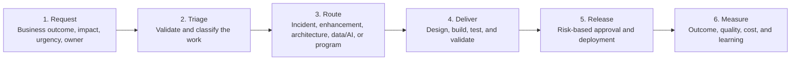

# Process and Controls

Modernization requires a transparent workflow that moves routine work quickly while applying stronger controls to changes with greater business, architecture, security, data, or financial risk.

The objective is not to add more approvals. It is to apply the **right level of control based on risk**.

## Common Current-State Challenges

- Work enters through multiple channels without consistent information or ownership.
- Priorities may be determined by influence rather than measurable business impact.
- Estimates and milestones may be based on incomplete assumptions.
- Delivery dates may move without assessing customer, financial, regulatory, architecture, or operational impact.
- Business stakeholders may have limited visibility into status and decisions.
- Simple, low-risk changes may be delayed by unnecessary approval gates.
- High-risk changes may proceed without sufficient architecture, security, quality, or business review.

---

## Step 4 — Create One Transparent Intake and Classification Path

### Action

Route the following work through a common intake process:

- Incidents
- Enhancements
- Architecture requests
- Data and AI requests
- Major programs and projects

Each request should include the business outcome, impact, urgency, ownership, dependencies, data sensitivity, architecture impact, and expected value.

### Technical Outputs

- Standard intake form
- Work-classification rules
- Routing logic
- Assigned ownership
- Visible enterprise backlog
- Decision and approval timestamps

### Expected Outcome

Less work is lost in email or informal channels, and business and technology teams see the same demand picture.

---

## Step 5 — Define Service Levels and Severity Using Business Impact

### Action

Set response and restoration expectations based on:

- Business criticality
- Customer impact
- Safety impact
- Financial exposure
- Regulatory impact
- Data sensitivity
- Availability of a workaround

### Technical Outputs

- Priority and severity definitions
- SLO and SLA targets
- Escalation rules
- Communication templates
- Operational dashboards

### Expected Outcome

The most damaging issues are addressed first, expectations are clear, and operational performance becomes measurable.

---

## Step 6 — Create Risk-Based Change and Delivery Paths

### Action

Separate changes into three paths:

- **Standard changes:** Repeatable, low-risk, tested, and preapproved.
- **Normal changes:** Require review proportional to business, architecture, security, data, quality, and financial impact.
- **Emergency changes:** Use an expedited path to restore service but require a post-implementation review.

### Technical Outputs

- Change-classification decision tree
- Approval matrix
- Automated quality and security checks
- Release-evidence requirements
- Rollback requirements
- Post-implementation review process

### Expected Outcome

Low-risk work moves faster while high-risk work receives appropriate control.

---

## Step 7 — Govern the Investment Portfolio and Measure Outcomes

### Action

Review technology demand as one enterprise portfolio rather than as unrelated requests.

- Apply common decision criteria.
- Compare investments side by side.
- Sequence work based on value, risk, dependencies, capacity, and readiness.
- Refresh portfolio decisions quarterly.
- Track reliability, delivery, quality, financial, risk, and workforce measures.

### Technical Outputs

- Annual technology portfolio
- Quarterly portfolio rebalancing
- Capacity and resource plan
- Multiyear funding view
- Benefit-realization measures
- Executive performance dashboard

### Expected Outcome

Investment moves toward the highest-value work with transparent tradeoffs and measurable results.

---

## Risk-Based Work Intake and Delivery Flow

> **Control principle:** Standard changes should move quickly. Higher-risk changes should receive proportionate architecture, security, quality, data, and business review.

---

## Service-Level Framework

A service-level framework defines how quickly technology teams acknowledge and restore service based on business impact.

- **Response time:** Time from reporting until a qualified resource acknowledges the issue and begins active work.
- **Restoration or resolution time:** Time until service is restored through a permanent fix or an approved workaround.

### Illustrative Service Targets

| Priority | Business Impact | Target Response | Target Restoration | Executive Escalation |
|---|---|---:|---:|---|
| **P1 — Critical** | Enterprise-wide outage, safety concern, or major customer, financial, or regulatory impact | 30 minutes | 8 hours | Immediate; escalate at defined intervals |
| **P2 — High** | Significant degradation or material business interruption | 1 business hour | 24 hours | Escalate when the target is at risk |
| **P3 — Medium** | Limited impact with a workaround available | 8 business hours | 5 business days | Operational management |
| **P4 — Low** | Minor issue, service request, or backlog item | Next business day | Next planning cycle | Not normally required |

These targets are illustrative. Each organization should adjust them based on operating hours, criticality, contractual commitments, staffing, regulatory requirements, and its actual ability to restore service.

---

## Unified Intake Flow

| Step | Flow |
|---:|---|
| **1** | A user submits a request through the approved work-management or service channel. |
| **2** | An analyst or lead validates completeness, business outcome, impact, urgency, data sensitivity, ownership, and routing. |
| **3** | The work is classified as an incident, enhancement, architecture change, data or AI request, or major program. |
| **4** | Incidents follow priority-based response, diagnosis, testing, business validation, controlled deployment, and closure. |
| **5** | Enhancements are estimated and delivered through planned increments with quality, security, architecture, and business acceptance proportional to risk. |
| **6** | Requests exceeding the organization’s agreed size, cost, architecture impact, risk, or duration threshold move into portfolio governance. |

---

## Annual Technology Portfolio Planning

Technology demand should be reviewed as a portfolio rather than as a sequence of isolated requests.

An annual planning cycle, supported by quarterly refreshes, allows executives to compare investment, dependencies, architecture impact, capacity, cost, risk, and strategic value in one decision forum.

| Stage | Executive Purpose |
|---|---|
| **Stage 1 — Intake** | Business units submit anticipated technology needs for the planning horizon. |
| **Stage 2 — Standard Business Case** | Each request states the objective, expected value, urgency, proposed approach, dependencies, architecture impact, risk, priority, multiyear cost, and measurable outcome. |
| **Stage 3 — Cross-Functional Review** | Technology, finance, security, architecture, data, operations, and business leaders evaluate requests using common criteria. |
| **Stage 4 — Decision** | Leadership approves, defers, reshapes, combines, or declines each request. |
| **Stage 5 — Sequencing and Readiness** | Approved work is sequenced based on value, risk, dependencies, capacity, target architecture, and organizational readiness. |

### Portfolio Decision Criteria

- Strategic alignment and business-capability value
- Customer and employee impact
- Revenue enablement, cost reduction, or productivity improvement
- Operational resilience and risk reduction
- Regulatory, security, privacy, data, and compliance requirements
- Architecture fit and dependencies
- Delivery feasibility and organizational readiness
- Total cost of ownership
- AI and model cost, where applicable
- Measurable benefits
- Opportunity cost and impact on committed work

---

## Executive Performance Measures

| Category | Example Measures |
|---|---|
| **Reliability** | Availability, critical incidents, mean time to restore, recurring incidents, and recovery readiness |
| **Delivery** | Commitment reliability, lead time, milestone variance, deployment frequency, and backlog aging |
| **Quality** | Escaped defects, change-failure rate, automated test coverage, security defects, and rework |
| **Financial** | Run/change spend, forecast variance, total cost of ownership, cost avoidance, benefit realization, and AI usage cost |
| **Risk** | Critical vulnerabilities, unsupported assets, resilience gaps, audit findings, and data or AI control exceptions |
| **People** | Critical-role coverage, skills development, knowledge documentation, retention, and succession readiness |

---

## Outcomes

- Business and technology teams see one transparent demand portfolio.
- Work is prioritized using measurable business impact.
- Low-risk changes move faster through preapproved paths.
- Higher-risk changes receive appropriate architecture, security, quality, data, and business review.
- Leadership understands capacity, funding, dependencies, and investment tradeoffs.
- Delivery, operational performance, cost, risk, and benefits become measurable.

---

[← Previous: People and Governance](../01-people-and-governance/) | [Back to Overview](../) | [Next: Technology Visibility →](../03-technology-visibility/)
