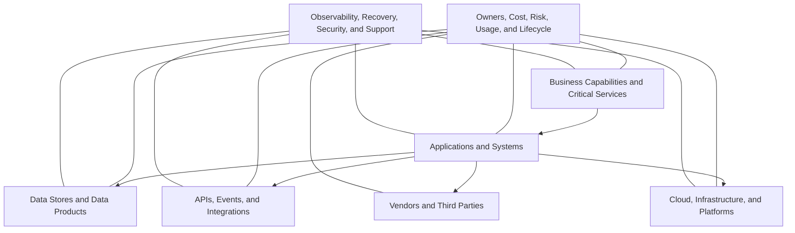

# Technology Visibility

Modernization cannot be governed effectively when applications, data, infrastructure, integrations, ownership, cost, usage, risk, and lifecycle status are fragmented across teams and tools.

Technology visibility creates the evidence base required for architecture, investment, resilience, incident, risk, and AI-readiness decisions.

## Common Current-State Challenges

- Technology estates have grown through acquisitions, urgent business needs, decentralized decisions, and local optimization.
- Information about applications, data, infrastructure, integrations, vendors, licenses, ownership, cost, usage, and lifecycle status is incomplete or inconsistent.
- Teams have limited visibility into how an incident or change affects connected systems, customers, data flows, and business processes.
- Root-cause analysis is inconsistent, and recurring problems are not always prevented.
- Duplicate or overlapping platforms increase cost, complexity, data fragmentation, and security exposure.
- Legacy code, scarce skills, weak documentation, and tightly coupled architecture slow onboarding and modernization.
- AI pilots fail to scale because data, integration, security, observability, or cost controls are missing.

---

## Step 8 — Build the Technology Asset and Relationship Repository

### Action

Create a trusted inventory of:

- Business services
- Applications
- Data stores
- Interfaces and APIs
- Infrastructure and cloud resources
- Vendors and third parties
- Licenses and contracts
- Business and technology owners
- Cost and usage
- Risk and lifecycle status
- Recovery requirements
- Critical dependencies

The objective is not to create a large database for its own sake. The repository must support real decisions about modernization, risk, cost, resilience, and AI readiness.

### Technical Outputs

- Technology asset and configuration repository
- Common data model
- Ownership fields
- Cost and usage fields
- Risk and lifecycle classifications
- Relationship mapping
- Data-quality rules
- Certification process
- Executive reporting views

### Expected Outcome

Leadership gains one reliable evidence base for architecture, investment, incident, risk, cost, and modernization decisions.

---

## Step 9 — Map Critical Business Services, Dependencies, and Data Flows

### Action

Connect each critical business capability and service to:

- Applications
- Data stores and data products
- APIs, events, and interfaces
- Infrastructure and cloud platforms
- External providers
- Support teams
- Recovery requirements
- Security and identity controls
- Monitoring and telemetry

### Technical Outputs

- Business capability-to-application map
- Service dependency map
- Data-flow map
- Integration catalog
- Recovery and resilience map
- Criticality tiers
- Ownership matrix
- Service-level and support relationships

### Expected Outcome

The organization understands blast radius, modernization dependencies, recovery priorities, and where AI can connect safely.

---

## Technology Visibility Architecture

> **Visibility principle:** Every critical business service should be traceable to the applications, data, integrations, infrastructure, vendors, owners, cost, risk, and recovery capabilities that support it.

---

## Repository Implementation Sequence

| Activity | Technical Detail |
|---|---|
| **1. Align** | Agree on scope, the decisions the repository must support, minimum required data, ownership, and certification frequency. |
| **2. Select the Repository** | Choose a fit-for-purpose platform, data model, integrations, and reporting approach. |
| **3. Collect and Cleanse** | Reconcile information from discovery tools, cloud platforms, source control, monitoring, finance, procurement, vendors, and teams. |
| **4. Map Relationships** | Connect business capabilities, applications, data, integrations, infrastructure, support, recovery, and third parties. |
| **5. Govern and Grow** | Assign owners, monitor data quality, update records through change processes, and periodically certify critical information. |

A formal configuration-management platform may be appropriate, but the program should begin with the minimum tool capable of producing accurate, governed information.

---

## Minimum Data Set

| Data Domain | Minimum Information |
|---|---|
| **Business Service** | Service name, business owner, criticality, customer or employee impact, recovery objective |
| **Application** | Application owner, purpose, users, business value, lifecycle, technical health, support model |
| **Data** | Data owner, classification, source, quality, retention, lineage, approved usage |
| **Integration** | Source, destination, interface type, frequency, dependency, failure impact, owner |
| **Infrastructure** | Platform, environment, location, capacity, support status, resilience, cost |
| **Vendor / Contract** | Provider, service, contract owner, renewal date, cost, dependency, exit constraints |
| **Risk** | Security exposure, unsupported technology, resilience gap, compliance issue, technical debt |
| **Financial** | License cost, infrastructure cost, support cost, vendor cost, total cost of ownership |
| **Operations** | Monitoring, runbook, support team, escalation path, recovery procedure, service level |

---

## Data Quality and Governance

Technology visibility remains useful only when the information is maintained.

- Assign an accountable owner for each critical record.
- Update the repository through architecture, change, procurement, onboarding, and decommissioning processes.
- Automate discovery where practical, but require validation for critical services.
- Track completeness, accuracy, age, and certification status.
- Reconcile technology records with finance, procurement, security, cloud, monitoring, and source-control data.
- Review critical-service information on a defined cadence.
- Treat missing ownership, lifecycle, cost, risk, or dependency information as a governance exception.

---

## Executive Questions This Section Should Answer

- Which systems support our most critical business services?
- Who owns each service, application, data product, integration, and platform?
- What is the operational and customer impact if a component fails?
- What are the most important dependencies and single points of failure?
- Which systems are unsupported, high risk, duplicated, or expensive?
- What is the true cost of each business capability and application?
- Which applications and data are ready for modernization or AI enablement?
- Where can AI connect safely, and where are data or control gaps still present?

---

## Outcomes

- Leadership gains a trusted view of the technology estate.
- Critical business services are connected to the systems and teams that support them.
- Incident impact and modernization blast radius become visible.
- Cost, risk, ownership, usage, and lifecycle decisions are based on evidence.
- Duplicate, unsupported, and low-value technology can be identified.
- Application rationalization and target architecture can begin with reliable information.
- AI readiness can be assessed against actual data, integration, security, and operational dependencies.

---

[← Previous: Process and Controls](https://github.com/aksikha/Technology-Modernization-for-AI-Readiness/tree/main/02-process-and-controls) | [Back to Overview](https://github.com/aksikha/Technology-Modernization-for-AI-Readiness) | [Next: Portfolio and Architecture →](https://github.com/aksikha/Technology-Modernization-for-AI-Readiness/tree/main/04-portfolio-and-architecture)
