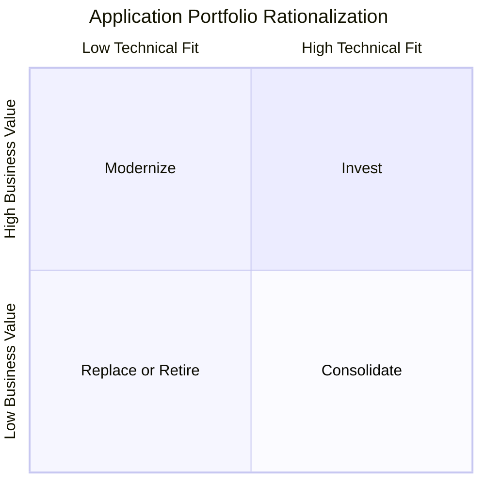
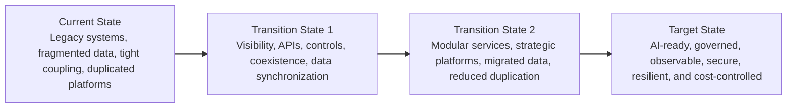

# Portfolio and Architecture

Technology visibility provides the evidence needed to decide what should be protected, modernized, consolidated, replaced, or retired.

This section turns that evidence into explicit portfolio decisions and a controlled transition from the current technology estate to a target architecture that supports resilience, modularity, governed data, and AI readiness.

## Common Current-State Challenges

- Applications are funded and maintained without a consistent view of business value, technical health, risk, cost, usage, or lifecycle status.
- Duplicate systems remain in place because ownership and transition decisions are unclear.
- Modernization initiatives replace technology without defining the required transition states.
- Architecture decisions are made project by project rather than by business capability or domain.
- Dependencies, coexistence, data migration, cutover, rollback, and decommissioning are considered too late.
- Strategic applications are underfunded while low-value or high-risk systems continue consuming resources.
- AI initiatives are introduced without the architecture, data, integration, observability, security, or cost controls needed to scale.

---

## Step 10 — Rationalize the Application Portfolio

### Action

Evaluate each application using a consistent set of criteria:

- Business value
- Technical health
- Security and operational risk
- Total cost of ownership
- Usage and adoption
- Strategic fit
- Data value
- Integration complexity
- Lifecycle status
- Vendor and support dependency
- AI-readiness potential

Each application should be assigned an explicit decision path with a named owner, supporting evidence, target date, transition approach, and expected benefit.

### Technical Outputs

- Application assessment scorecard
- Invest / Modernize / Consolidate / Replace-Retire decision
- Named business and technology owner
- Target date and transition plan
- Cost and benefit estimate
- Risk and dependency view
- Decommissioning requirements
- Portfolio decision record

### Expected Outcome

Investment is directed toward strategic capabilities while duplication, technical debt, unsupported technology, cost, and operational risk are reduced.

---

## Application Portfolio Rationalization

> **Decision principle:** Every application should have a documented investment path, accountable owner, supporting evidence, and transition plan.

---

## Four Portfolio Decision Paths

| Decision Path | When It Applies | Typical Technical Actions |
|---|---|---|
| **Invest** | High business value and strong strategic or technical fit | Protect, enhance, scale, API-enable, automate, improve resilience, and fund proactively |
| **Modernize** | Important to the business but constrained by technical debt, architecture, scalability, security, or operability | Upgrade, re-platform, refactor, redesign, migrate, modularize, or selectively replace |
| **Consolidate** | Overlapping capabilities, vendors, data, interfaces, or user groups | Standardize on strategic platforms, migrate users and data, simplify integrations, and retire duplication |
| **Replace / Retire** | Low value, poor fit, excessive risk, unsupported technology, or redundant capability | Migrate required functionality and data, close dependencies, remove access and contracts, and decommission safely |

---

## Step 11 — Define Target and Transition Architectures

### Action

Design the future technology stack by business capability and domain.

The target architecture should describe the desired end state across:

- Business capabilities and channels
- Applications and services
- APIs, events, and integrations
- Data products and platforms
- AI services and model access
- Cloud, infrastructure, and platform engineering
- Identity and security
- Observability and operations
- Resilience and recovery
- FinOps and cost management

The transition architecture should define how the organization moves from the current estate to the target state without disrupting critical services.

### Technical Outputs

- Business capability map
- Current-state architecture
- Target-state architecture
- Transition-state architectures
- Architecture decision records
- Standards and reference patterns
- Coexistence and integration approach
- Data migration and synchronization plan
- Cutover and rollback design
- Decommissioning plan
- Modernization wave plan

### Expected Outcome

Modernization becomes a controlled architectural transition rather than a sequence of unrelated technology replacements.

---

## Current, Transition, and Target Architecture

> **Architecture principle:** Every modernization decision should define the intermediate states required to protect business continuity—not only the end-state diagram.

---

## Core Architecture Artifacts

| Architecture Artifact | Purpose |
|---|---|
| **Business Capability Map** | Connects strategy and outcomes to the capabilities technology must support |
| **Current-State Architecture** | Documents systems, data, integrations, infrastructure, dependencies, constraints, and risk |
| **Target-State Architecture** | Defines the desired domains, services, APIs and events, data and AI platform, security, cloud or platform model, and operations model |
| **Transition Architectures** | Describe intermediate states, coexistence, data synchronization, integration bridges, cutover, and rollback |
| **Architecture Decision Records** | Record the decision, alternatives, evidence, tradeoffs, cost, risk, owner, and review date |
| **Modernization Wave Plan** | Sequences applications and capabilities based on dependency, value, risk, readiness, and capacity |

---

## Architecture Decision Sequence

1. Confirm the business capability and outcome the application supports.
2. Assess business criticality, user impact, risk, cost, technical health, usage, and dependencies.
3. Select the investment path: Invest, Modernize, Consolidate, or Replace-Retire.
4. Define the target architecture and required transition states.
5. Identify coexistence, integration, data, security, recovery, and operational requirements.
6. Sequence the work to protect continuity and manage dependencies.
7. Define measurable outcomes, accountable owners, and decision gates.
8. Execute the modernization wave.
9. Validate the business and technical outcomes.
10. Decommission replaced applications, data copies, contracts, access, integrations, infrastructure, and monitoring.

---

## Modernization Wave Planning

Modernization should be executed in coordinated waves rather than as isolated projects.

Each wave should define:

- Business capability in scope
- Applications and services affected
- Dependencies and blast radius
- Target and transition architecture
- Data migration and reconciliation
- Security and identity controls
- Observability and operational readiness
- Cutover and rollback
- Decommissioning
- Cost, benefits, and measurable outcomes
- Executive and technical decision gates

### Wave Sequencing Criteria

- Business value
- Operational and security risk
- Architecture dependency
- Regulatory or lifecycle urgency
- Readiness of data and integrations
- Organizational capacity
- Vendor and contract timing
- Customer and employee impact
- Cost and expected benefit
- AI-readiness opportunity

---

## Architecture Governance

- Assign accountable owners for domains, platforms, applications, data, and architecture decisions.
- Use architecture decision records to preserve rationale and tradeoffs.
- Review exceptions based on business value, risk, cost, duration, and remediation plan.
- Keep standards practical and reusable.
- Align architecture review depth to the risk and reversibility of the change.
- Track transition-state completion, not only target-state approval.
- Require decommissioning evidence before modernization benefits are considered complete.
- Review architecture outcomes through portfolio and executive governance.

---

## Executive Questions This Section Should Answer

- Which applications should receive investment, modernization, consolidation, or retirement?
- What evidence supports each portfolio decision?
- What is the target architecture for each critical business capability?
- What transition states are required to move safely?
- How will data, integrations, identity, security, and operations work during coexistence?
- What are the major dependencies and sequencing constraints?
- What must be decommissioned to realize the expected cost and risk reduction?
- How does the architecture prepare the organization for responsible AI adoption?

---

## Outcomes

- Technology investment is aligned to business value, risk, cost, and strategic fit.
- Duplicate, low-value, unsupported, and high-risk systems are reduced.
- Strategic platforms receive focused investment.
- Modernization decisions include clear transition states and measurable outcomes.
- Business continuity is protected through coexistence, migration, cutover, and rollback planning.
- Architecture decisions become traceable, governed, and repeatable.
- The organization establishes the modular, governed, observable, secure, and cost-controlled foundation required for AI readiness.

---

[← Previous: Technology Visibility](https://github.com/aksikha/Technology-Modernization-for-AI-Readiness/tree/main/03-technology-visibility) | [Back to Overview](https://github.com/aksikha/Technology-Modernization-for-AI-Readiness) | [Next: AI-Enabled Modernization →](https://github.com/aksikha/Technology-Modernization-for-AI-Readiness/tree/main/05-ai-enabled-modernization)
