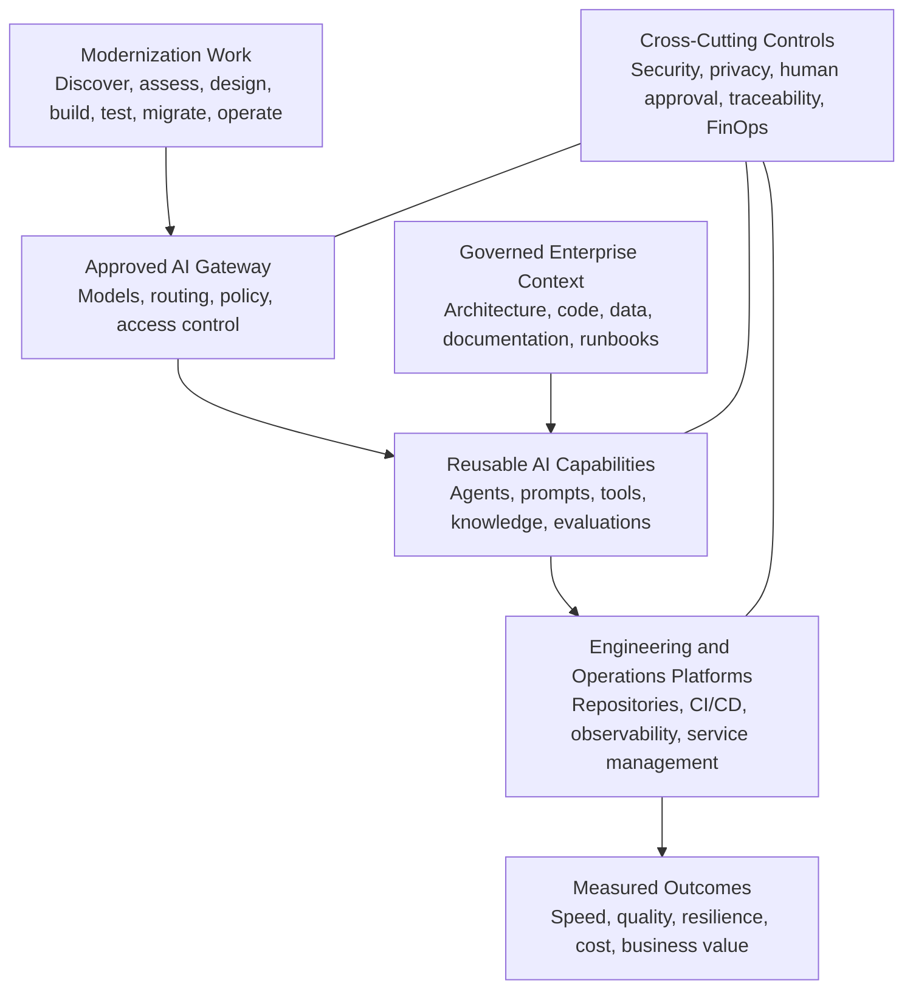
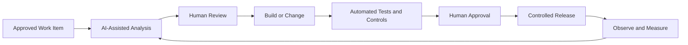

# AI-Enabled Modernization

AI should not be introduced as a disconnected pilot or a separate technology silo.

It should be embedded into a modernization architecture that already has accountable ownership, transparent process, trusted technology visibility, governed data, secure integration, observability, and cost controls.

The purpose of AI is to increase the speed and quality of repeated modernization work while keeping architecture, security, traceability, human accountability, and economics under control.

---

## Step 12 — Establish the AI-Enabled Modernization Platform and Factory

### Action

Provide governed AI capabilities that can be reused across modernization waves for:

- Technology discovery
- Code and architecture analysis
- Documentation
- Test generation
- Refactoring
- Data mapping and migration
- Knowledge retrieval
- Incident triage
- Operational optimization
- Continuous improvement

AI capabilities should be delivered through approved platforms, reusable patterns, and controlled engineering workflows rather than through unmanaged individual access.

### Technical Outputs

- Approved model gateway
- Secure development and runtime environments
- Identity, access, and secrets controls
- Prompt, model, tool, and output logging
- Model and use-case evaluation
- Human approval points
- Reusable engineering agents and workflows
- CI/CD integration
- AIOps and observability telemetry
- Usage budgets and cost controls
- Benefit and quality measures

### Expected Outcome

AI increases speed, quality, and consistency across repeated modernization waves while security, architecture, traceability, human accountability, and cost remain controlled.

---

## AI-Enabled Modernization Architecture

> **AI principle:** AI should accelerate governed modernization work—not bypass architecture, security, quality, data, or business accountability.

---

## AI Embedded Across the Modernization Lifecycle

| Lifecycle Stage | AI-Enabled Technical Work | Measures |
|---|---|---|
| **Discover** | Extract asset information, summarize repositories, identify undocumented dependencies, and create searchable knowledge indexes | Inventory completeness, analyst hours saved, dependency accuracy |
| **Assess** | Analyze code quality, vulnerabilities, technical debt, usage, cost, and modernization options | Assessment cycle time, validated findings, defect recall |
| **Design** | Draft architecture documentation, interface contracts, data mappings, test scenarios, and decision alternatives | Review time, documentation completeness, decision turnaround |
| **Build and Test** | Assist refactoring, generate tests, validate standards, identify regression risk, and explain legacy logic | Lead time, automated test coverage, rework, escaped defects |
| **Migrate** | Support schema mapping, conversion scripts, reconciliation, data-quality checks, and cutover planning | Migration velocity, reconciliation accuracy, cutover defects |
| **Operate** | Correlate telemetry, triage incidents, retrieve runbooks, predict capacity, and recommend remediation | Mean time to restore, recurring incidents, operator productivity |

---

## Approved Model Gateway

An approved model gateway provides a controlled entry point to AI services.

It should support:

- Centralized model access
- Identity and authorization
- Approved model catalog
- Data and content policies
- Routing to the smallest effective model
- Usage quotas and budgets
- Prompt and output logging
- Evaluation and monitoring
- Model version control
- Exception handling
- Vendor and contract governance

The gateway reduces uncontrolled direct access to public AI services and allows the organization to apply consistent security, cost, quality, and audit controls.

---

## Human Accountability

AI can assist with analysis and execution, but accountable people remain responsible for material outcomes.

Human review should be required for:

- Generated production code
- Security findings and remediation
- Architecture decisions
- Data classification and usage
- Production changes
- Customer or employee impacts
- Regulatory or financial decisions
- High-risk operational actions
- Model exceptions and overrides

Human approval points should be designed into the workflow rather than added informally after deployment.

---

## AI Governance and Cost Architecture

### Security and Data Controls

- Use approved models and environments.
- Prevent confidential information, credentials, source code, customer data, or regulated content from reaching unapproved services.
- Apply data classification, access control, retention, and approved-use rules.
- Separate development, testing, and production environments.
- Protect secrets, service accounts, tools, and connected systems.
- Test AI-generated outputs before production use.

### Model and Quality Controls

- Match each use case to an appropriate model.
- Route work to the smallest effective model.
- Define when premium models are justified.
- Evaluate accuracy, latency, quality, rework, and failure modes.
- Monitor model and prompt changes.
- Maintain approved fallback and escalation paths.
- Review performance before scaling.

### Cost Controls

- Set usage budgets and quotas.
- Track cost by team, use case, model, environment, and business outcome.
- Use showback or chargeback where appropriate.
- Establish alerts for abnormal consumption.
- Measure cost per modernization activity.
- Compare AI cost against time saved, quality improved, risk reduced, and business value created.
- Apply FinOps discipline to AI usage from the beginning.

### Traceability

Retain the information required to understand:

- Which model was used
- Which prompt and tools were used
- Which data sources were accessed
- What evaluation was performed
- Who reviewed or approved the output
- What change was implemented
- What outcome was achieved

---

## AI Use-Case Selection

AI use cases should begin as bounded, measurable capabilities.

Evaluate each candidate using:

| Criterion | Question |
|---|---|
| **Business Value** | Does the use case improve speed, quality, resilience, cost, or decision-making? |
| **Repeatability** | Will the capability be reused across multiple modernization waves? |
| **Data Readiness** | Is the required information available, accurate, approved, and governed? |
| **Integration Readiness** | Can the AI capability connect safely to the required systems and workflows? |
| **Risk** | What security, privacy, operational, regulatory, or reputational risk exists? |
| **Human Review** | Where is accountable human judgment required? |
| **Measurability** | Can quality, cost, productivity, and benefit be measured? |
| **Scalability** | Can the capability operate reliably beyond a pilot? |

---

## AI-Enabled Engineering Workflow

> **Control loop:** AI output should be reviewed, tested, released through approved controls, and measured so the next modernization wave improves.

---

## Measures

| Category | Example Measures |
|---|---|
| **Productivity** | Analysis time, documentation time, development lead time, operator effort |
| **Quality** | Test coverage, escaped defects, rework, validated findings, output acceptance rate |
| **Operations** | Mean time to restore, recurring incidents, alert quality, remediation time |
| **Migration** | Mapping speed, reconciliation accuracy, cutover defects, data-quality exceptions |
| **Financial** | AI usage cost, cost per use case, cost avoided, benefit realized |
| **Risk** | Policy exceptions, unapproved data exposure, human-review failures, control violations |
| **Adoption** | Active users, reusable workflows, modernization waves supported, training completion |

---

## Executive Questions This Section Should Answer

- Which modernization activities should AI accelerate first?
- Are the required data, integration, security, and operational foundations in place?
- Is AI access controlled through an approved platform?
- Are generated outputs reviewed and tested before production use?
- Can leadership see model usage, quality, risk, and cost?
- Are AI capabilities reusable across modernization waves?
- Are business benefits measured against total AI cost?
- Can the organization explain how an AI-assisted decision or change was produced?

---

## Outcomes

- Modernization work becomes faster and more repeatable.
- Engineering documentation, testing, migration, and operations improve in quality and consistency.
- AI access is governed through approved architecture and security controls.
- Human accountability remains explicit for material decisions and production changes.
- AI usage and model costs are visible and controlled.
- Reusable AI capabilities improve each modernization wave.
- AI adoption scales as part of the enterprise architecture rather than as disconnected pilots.

---

[← Previous: Portfolio and Architecture](https://github.com/aksikha/Technology-Modernization-for-AI-Readiness/tree/main/04-portfolio-and-architecture) | [Back to Overview](https://github.com/aksikha/Technology-Modernization-for-AI-Readiness) | [Next: Implementation Roadmap →](https://github.com/aksikha/Technology-Modernization-for-AI-Readiness/tree/main/06-implementation-roadmap)
