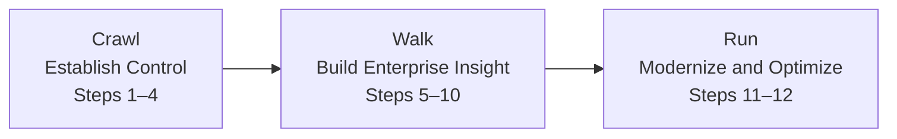

# Implementation Roadmap

Technology modernization should be phased so the organization builds accountability, control, and trustworthy information before scaling architecture change and AI.

The sequence matters:

1. Establish accountable people.
2. Simplify and govern the process.
3. Create visibility into the technology estate.
4. Rationalize the portfolio.
5. Define target and transition architectures.
6. Use AI to accelerate repeated modernization work.

Each phase should have an executive owner, technical outputs, measurable outcomes, and explicit exit criteria.

---

## Crawl, Walk, Run

> **Execution principle:** Do not scale modernization or AI until ownership, process, visibility, and decision quality are strong enough to support them.

---

## Phase 1 — Crawl: Establish Control

### Steps

- Step 1 — Align business outcomes and executive sponsorship
- Step 2 — Define ownership, roles, and decision rights
- Step 3 — Distribute knowledge and build modernization capability
- Step 4 — Create one transparent intake and classification path

### Primary Actions

- Confirm executive sponsorship.
- Define the business outcomes and constraints.
- Assign accountable business and technology owners.
- Establish decision rights and escalation paths.
- Document critical knowledge and backup coverage.
- Create one visible intake and demand backlog.

### Technical Outputs

- Modernization charter
- Outcome measures
- Ownership registry
- RACI
- Skills and succession plan
- Unified intake
- Visible backlog
- Baseline measures

### Exit Criteria and Outcomes

- Named owners are in place.
- Governance forums are functioning.
- Work is visible and classified.
- Priorities are agreed.
- Critical knowledge has documented coverage.
- Baseline reliability, delivery, risk, cost, and workforce measures exist.

---

## Phase 2 — Walk: Build Enterprise Insight

### Steps

- Step 5 — Define service levels and severity using business impact
- Step 6 — Create risk-based change and delivery paths
- Step 7 — Govern the investment portfolio and measure outcomes
- Step 8 — Build the technology asset and relationship repository
- Step 9 — Map critical business services, dependencies, and data flows
- Step 10 — Rationalize the application portfolio

### Primary Actions

- Define service levels and escalation rules.
- Establish standard, normal, and emergency change paths.
- Govern technology demand as one portfolio.
- Build the technology asset and relationship repository.
- Map critical business services and dependencies.
- Assess and rationalize the application portfolio.
- Establish cost, risk, ownership, and lifecycle visibility.

### Technical Outputs

- SLA and SLO model
- Risk-based change paths
- Portfolio plan
- Capacity and funding view
- Technology asset repository
- Service and dependency maps
- Data-flow and integration maps
- Application rationalization decisions

### Exit Criteria and Outcomes

- Service expectations are measurable.
- Low-risk work can move through preapproved paths.
- Portfolio decisions use common criteria.
- Critical technology information is trusted.
- Business-service dependencies are visible.
- Applications have an approved investment path.
- Leadership can see capacity, cost, risk, ownership, and lifecycle status.

---

## Phase 3 — Run: Modernize and Optimize

### Steps

- Step 11 — Define target and transition architectures
- Step 12 — Establish the AI-enabled modernization platform and factory

### Primary Actions

- Define current, target, and transition architectures.
- Sequence modernization waves.
- Establish the approved AI gateway and reusable AI capabilities.
- Integrate AI into discovery, assessment, design, build, test, migration, and operations.
- Execute modernization waves.
- Measure benefits, cost, quality, resilience, and risk.
- Decommission replaced technology and contracts.

### Technical Outputs

- Target architecture
- Transition-state architectures
- Architecture decision records
- Modernization wave plans
- Approved model gateway
- Reusable AI engineering workflows
- AI observability and cost controls
- Benefit-realization dashboards
- Decommissioning evidence

### Exit Criteria and Outcomes

- Modernization is executed through approved architectural transitions.
- AI adoption is governed, measurable, traceable, and cost-controlled.
- Strategic platforms receive focused investment.
- Technical debt, duplication, and unsupported technology are reduced.
- Reliability, delivery, and resilience improve.
- Business outcomes and financial benefits are realized.
- The organization has a repeatable modernization capability.

---

## Roadmap Summary

| Phase | Steps | Primary Focus | Technical Outputs | Exit Criteria / Outcomes |
|---|---:|---|---|---|
| **Crawl — Establish Control** | 1–4 | Alignment, accountability, knowledge, and transparency | Charter, RACI, ownership registry, knowledge plan, unified backlog | Named owners, functioning governance, visible work, agreed priorities, baseline measures |
| **Walk — Build Enterprise Insight** | 5–10 | Service discipline, portfolio governance, technology visibility, and rationalization | SLA/SLO model, change paths, portfolio plan, repository, service maps, rationalization decisions | Trusted inventory, architecture visibility, approved investment paths, capacity and funding transparency |
| **Run — Modernize and Optimize** | 11–12 | Target architecture, modernization waves, AI acceleration, and continuous improvement | Target and transition architectures, model gateway, AI workflows, wave plans, benefit dashboards | Reduced cost and risk, improved resilience and delivery, controlled AI adoption, repeatable modernization capability |

---

## First 90 Days

### Days 1–30 — Align and Baseline

- Confirm executive sponsorship.
- Define business outcomes, constraints, and critical services.
- Identify current pain points and major risks.
- Establish decision forums.
- Baseline reliability, delivery, risk, cost, and workforce measures.
- Identify accountable business, architecture, application, data, and platform owners.

### Days 31–60 — Establish Control and Visibility

- Define roles and RACI.
- Establish unified intake and priority rules.
- Define service levels.
- Create risk-based change paths.
- Select the repository fields and data sources.
- Begin current-state architecture collection.
- Identify one pilot business capability.

### Days 61–90 — Prove the Approach

- Complete a pilot service and dependency map.
- Rationalize a small application group.
- Define a target architecture pattern.
- Select one bounded AI-assisted modernization use case.
- Define measurable outcomes and controls.
- Approve the first modernization wave.

---

## Governance Cadence

| Cadence | Primary Review |
|---|---|
| **Weekly** | Delivery, incidents, technical risks, dependencies, architecture decisions, and blocked work |
| **Monthly** | Portfolio health, financial variance, architecture exceptions, security posture, data and AI controls, AI usage cost, and workforce capacity |
| **Quarterly** | Strategic priorities, benefit realization, application rationalization, modernization sequencing, capacity, and portfolio rebalancing |
| **Annually** | Multiyear technology strategy, investment plan, target architecture, risk appetite, critical skills, data and AI roadmap, and business-capability outcomes |

---

## Executive and Architecture Checklist

- [ ] Is the business outcome clearly defined before a technology solution or AI model is selected?
- [ ] Does every material initiative have one accountable business owner and one accountable technology owner?
- [ ] Can simple changes move through a proportional, preapproved control path?
- [ ] Can leadership see the full demand portfolio, capacity, cost, dependencies, architecture impact, and tradeoffs?
- [ ] Do we know which systems, data, integrations, infrastructure, teams, and vendors support critical business services?
- [ ] Are modernization decisions based on business value, technical health, cost, risk, usage, dependency, and lifecycle status?
- [ ] Does each modernization wave include current, target, and transition architecture?
- [ ] Are coexistence, data migration, cutover, rollback, and decommissioning planned?
- [ ] Are security, identity, quality, data, observability, resilience, FinOps, and AI controls embedded in the architecture?
- [ ] Are AI use cases bounded, measurable, evaluated, traceable, human-reviewed, and cost-controlled?
- [ ] Do we have measurable baselines and expected benefits for each modernization wave?
- [ ] Is critical knowledge documented, and is succession coverage available?
- [ ] Are replaced applications, data copies, contracts, access, integrations, infrastructure, and monitoring actually decommissioned?
- [ ] Does the board receive a concise view of business value, resilience, risk, investment, architecture progress, AI adoption, and realized outcomes?

---

## Final Outcomes

- Business and technology leaders share accountability for modernization.
- Work moves through transparent and risk-proportionate processes.
- Leadership has a trusted view of the technology estate.
- Portfolio decisions are based on value, risk, cost, dependency, and lifecycle evidence.
- Modernization follows current, transition, and target architectures.
- AI accelerates engineering and operations through governed, reusable capabilities.
- Business continuity, security, architecture, and cost remain controlled.
- The organization develops a repeatable modernization capability.

---

## Conclusion

Modernization is not complete when a new platform is deployed or an AI pilot is demonstrated.

It is complete when the organization has:

- Improved a business capability
- Reduced risk or cost
- Strengthened resilience
- Simplified the technology estate
- Established a repeatable architecture for continued change

The sequence matters: establish accountable people, simplify and govern the process, create visibility into the technology stack, rationalize the portfolio, define target and transition architectures, and then use AI to accelerate engineering, migration, knowledge, and operations.

---

## Closing Principle

> **AI does not replace the modernization architecture. AI increases the speed and quality of a modernization architecture that is already governed, observable, secure, and connected to business outcomes.**

---

[← Previous: AI-Enabled Modernization](https://github.com/aksikha/Technology-Modernization-for-AI-Readiness/tree/main/05-ai-enabled-modernization) | [Back to Overview](https://github.com/aksikha/Technology-Modernization-for-AI-Readiness)
