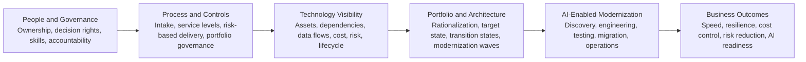

# Technology Modernization for AI Readiness

A step-by-step technical architecture for modernizing enterprise technology while protecting business continuity, controlling cost, and preparing the organization to use AI responsibly at scale.

## Who This Guide Is For

This guide is written for executives and technology leaders responsible for modernizing complex environments while maintaining operational stability.

| Audience | Primary Value |
|---|---|
| **CEO / Board** | Understand the sequence, investment logic, business outcomes, risk, and governance required for modernization |
| **CIO / CTO / CDO** | Translate business strategy into a governed modernization architecture and measurable execution roadmap |
| **CFO / Finance Leadership** | Connect portfolio decisions, total cost of ownership, FinOps, and AI cost controls to measurable value |
| **Enterprise Architects** | Define current, target, and transition architectures, dependencies, standards, and rationalization decisions |
| **Engineering / Operations Leaders** | Establish practical ownership, intake, service levels, release controls, observability, automation, and AI-enabled delivery |

---

## The Central Principle

> Modernization should not begin with a cloud product, an AI model, or a new platform.

It should begin by establishing accountable people and practical processes, followed by visibility into the technology stack.

Only after the organization understands what it owns, how systems connect, what they cost, and which capabilities matter should it rationalize the portfolio, define target and transition architectures, and use AI to accelerate modernization.

---

## Modernization Architecture at a Glance

The sequence is deliberate: fix accountability and process friction first, then expose and rationalize the technology estate, define the architecture, and finally apply AI at scale.

---

## The 12-Step Modernization Path

| Foundation | Steps | Technical Outcome |
|---|---:|---|
| **People and Governance** | 1–3 | Align outcomes and sponsorship, define ownership and decision rights, and distribute knowledge |
| **Process and Controls** | 4–7 | Establish transparent intake, service levels, risk-based delivery, portfolio governance, and measures |
| **Technology Visibility** | 8–9 | Build the technology repository and map critical services, dependencies, integrations, and data flows |
| **Portfolio and Architecture** | 10–11 | Rationalize applications and define current, target, and transition architectures |
| **AI-Enabled Modernization** | 12 | Establish governed AI capabilities for discovery, engineering, testing, migration, knowledge, and operations |

---

## Guide Sections

### 1. [People and Governance](https://github.com/aksikha/Technology-Modernization-for-AI-Readiness/tree/main/01-people-and-governance)

Steps 1–3 establish executive sponsorship, ownership, decision rights, knowledge coverage, roles, RACI, and production accountability.

### 2. [Process and Controls](https://github.com/aksikha/Technology-Modernization-for-AI-Readiness/tree/main/02-process-and-controls)

Steps 4–7 create unified intake, service levels, risk-based delivery paths, portfolio governance, and measurable performance.

### 3. [Technology Visibility](https://github.com/aksikha/Technology-Modernization-for-AI-Readiness/tree/main/03-technology-visibility)

Steps 8–9 build the technology asset repository and connect business services to applications, data, integrations, infrastructure, owners, cost, risk, and recovery.

### 4. [Portfolio and Architecture](https://github.com/aksikha/Technology-Modernization-for-AI-Readiness/tree/main/04-portfolio-and-architecture)

Steps 10–11 rationalize the application portfolio and define the target and transition architectures required for controlled modernization.

### 5. [AI-Enabled Modernization](https://github.com/aksikha/Technology-Modernization-for-AI-Readiness/tree/main/05-ai-enabled-modernization)

Step 12 embeds governed AI across discovery, assessment, design, build, test, migration, operations, observability, and cost control.

### 6. [Implementation Roadmap](https://github.com/aksikha/Technology-Modernization-for-AI-Readiness/tree/main/06-implementation-roadmap)

The Crawl–Walk–Run roadmap translates the 12 steps into phased execution, first-90-day actions, governance cadence, exit criteria, and an executive checklist.

---

## Expected Business Outcomes

- Faster and more predictable response to changing business priorities
- Clear ownership for services, applications, data, architecture decisions, programs, and production changes
- Transparent evaluation and sequencing of technology investments
- Reduced operational risk, technical debt, duplication, and avoidable cost
- Improved resilience through documented knowledge, dependency visibility, and succession coverage
- A controlled path from the current estate to target and transition architectures
- AI-enabled engineering and operations with security, human accountability, observability, and cost controls

---

## What This Guide Produces

- A clear sequence of modernization steps, technical outputs, decision gates, and expected outcomes
- A governance structure connecting business, architecture, engineering, security, finance, data, and operations
- A technical path from current-state visibility to rationalization, target architecture, AI enablement, and modernization waves
- Operational controls that make the architecture executable
- A repeatable approach that can be adapted to the organization’s size, industry, risk profile, and maturity

---

## Closing Principle

> **AI does not replace the modernization architecture. AI increases the speed and quality of a modernization architecture that is already governed, observable, secure, and connected to business outcomes.**

---

**Ajay Sikha**  
Executive Technology Leadership Portfolio
